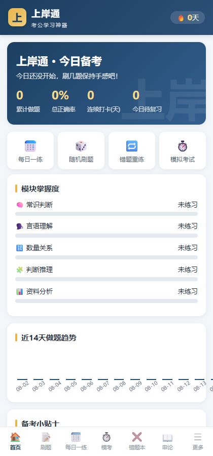
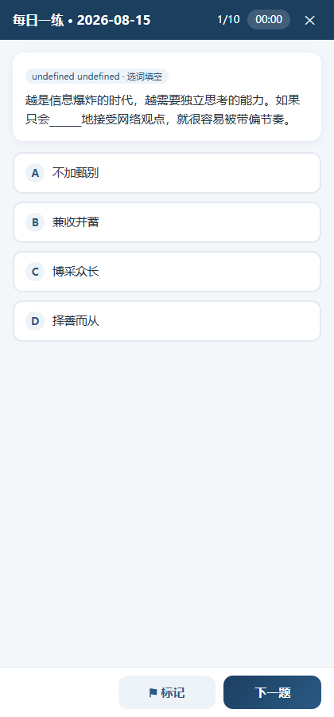
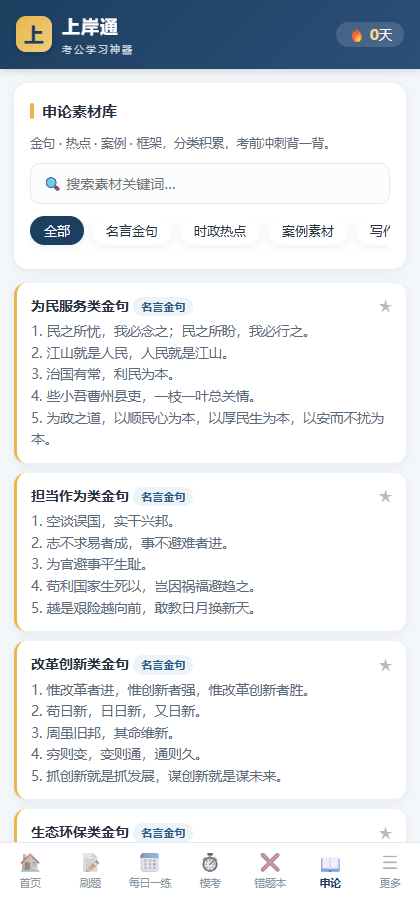
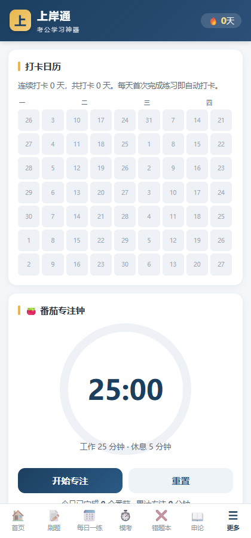

# 上岸通 · 考公学习神器 📚

> 一站式公务员考试备考工具：行测刷题、每日一练、模拟考试、错题本、申论素材、打卡追踪、番茄专注钟。
> **纯前端、零依赖、离线可用**，打开即用，学习数据保存在本地。

 

## ✨ 功能特性

   

> 移动端效果预览（左→右：主页仪表盘 / 每日一练答题 / 申论素材库 / 打卡日历与番茄钟）

| 功能 | 说明 |
|------|------|
| 📝 **行测刷题** | 五大模块（常识判断 / 言语理解 / 数量关系 / 判断推理 / 资料分析），**894 题**（90 原创 + 804 精选扩充），每题附详细解析与考点标签 |
| 📅 **每日一练** | 按日期固定生成 10 题组合练习（当天题目不变），保持学习手感 |
| ⏱️ **模拟考试** | 按国考题型结构组卷（常识 20% / 言语 30% / 数量 10% / 判断 25% / 资料 15%），支持自定义题量与时长，交卷出具成绩单 |
| ❌ **错题本** | 答错自动收录，支持单题精练、按模块筛选、标记掌握 |
| 🧠 **艾宾浩斯复习** | 错题按遗忘曲线（1/2/4/7/15 天）自动安排复习提醒 |
| 📖 **申论素材库** | 名言金句 / 时政热点 / 案例素材 / 写作框架 / 应用文模板，支持搜索、收藏、自定义添加 |
| 🔥 **打卡追踪** | GitHub 风格热力图日历 + 连续打卡天数统计 |
| 📊 **学习统计** | 累计做题、总正确率、各模块掌握度、近 14 天趋势图 |
| 🍅 **番茄专注钟** | 25 分钟专注 / 5 分钟休息循环，统计专注时长 |
| 💾 **数据备份** | 一键导出 / 导入 JSON 备份，随时迁移设备 |

## 🚀 快速开始

### 方式一：直接打开（推荐）
用浏览器打开 `index.html` 即可使用，无需安装任何东西，完全离线可用。

### 方式二：本地服务器
```bash
# Python 3
python -m http.server 8080
# 然后访问 http://localhost:8080
```

### 方式三：在线使用（GitHub Pages）
应用已部署在线版，无需下载直接访问：
**https://andesiwangzhiyi-alt.github.io/gongkao-shangantong/**

### 方式四：部署到自己的 GitHub Pages
把仓库 fork 后，在仓库 Settings → Pages 中选择 `main` 分支即可在线访问。

## 📁 目录结构

```
gongkao-shangantong/
├── index.html          # 应用入口
├── css/
│   └── style.css       # 样式（移动优先响应式）
├── js/
│   ├── questions.js    # 题库：常识判断 + 言语理解（40题原创）
│   ├── questions2.js   # 题库：数量关系 + 判断推理（35题原创）
│   ├── questions3.js   # 题库：资料分析（15题原创）
│   ├── questions4.js   # 题库扩充：804题（数字推理/数学运算/模考等，来自开源题库）
│   ├── shenlun.js      # 申论素材库（20条）
│   └── app.js          # 应用逻辑（答题引擎/错题本/打卡/番茄钟等）
└── docs/
    └── (使用文档与扩充指南)
```

## 📚 真题资源库（全网精选）

App 内「更多 → 真题资源库」也内置了这些入口：

| 资源 | 内容 | 地址 |
|---|---|---|
| 🏛️ **历年省考行测真题 PDF** | 2003-2025 全国 30+ 省市《行测》真题+答案解析（1.1GB，持续更新），含联考/选调/深圳市考等 | github.com/SGHCN0762/civil-provice-exam-xingce |
| 📱 **粉笔真题在线刷** | 国考 36 套（2026 行政执法/地市级/副省级最新）+ 30 省市真题 + 国考/省考模拟题 | fenbi.com/spa/tiku/guide/realTest/xingce/xingce |
| 📚 **申论/综应题库** | 结构化申论 3853 题 + 事业单位综应 1035 题（md，含参考答案/解析/考点） | github.com/2421873411a-rgb/gongkao-tiku |
| 🤖 **粉笔历年真题批量下载** | 开源爬虫，填粉笔账号即可批量下载粉笔历年真题 PDF | github.com/dduutt/fenbi |

> 题库扩充数据来源：[xingce-practice](https://github.com/gesu14/xingce-practice)（北森冲刺包/模考/数字推理精选/数学运算精选，MIT）。

## 🔧 扩充题库

在 `js/questions.js`（或新建 `questions4.js`）中按以下格式添加题目，然后在 `index.html` 引入：

```js
QUESTION_BANK["常识判断"].push({
  id: "cs21",                    // 唯一编号
  type: "政治",                  // 题型/考点分类
  stem: "题目题干……",            // 支持 \n 换行（材料题）
  options: ["选项A", "选项B", "选项C", "选项D"],
  answer: 0,                     // 正确选项下标（0-3）
  analysis: "答案解析……",
  tag: "考点标签"
});
```

> 资料分析题添加 `mat: "mat1"` 字段并共享 `stem` 前缀材料，题目会自动识别材料并单独展示。

## 📌 备考小贴士（内置）

- 行测 120 分钟 135 题，平均每题不到 1 分钟，时间优先留给有把握的题
- 建议作答顺序：言语 → 判断 → 资料 → 常识 → 数量
- 数量关系放最后，不会就果断放弃，不恋战
- 资料分析性价比最高，优先完成

## 📄 License

[MIT](LICENSE) © andesiwangzhiyi-alt

## ⭐ 支持

如果这个工具对你有帮助，欢迎 Star ⭐ 支持！也欢迎提交 Issue 反馈题目错误或建议新功能。
